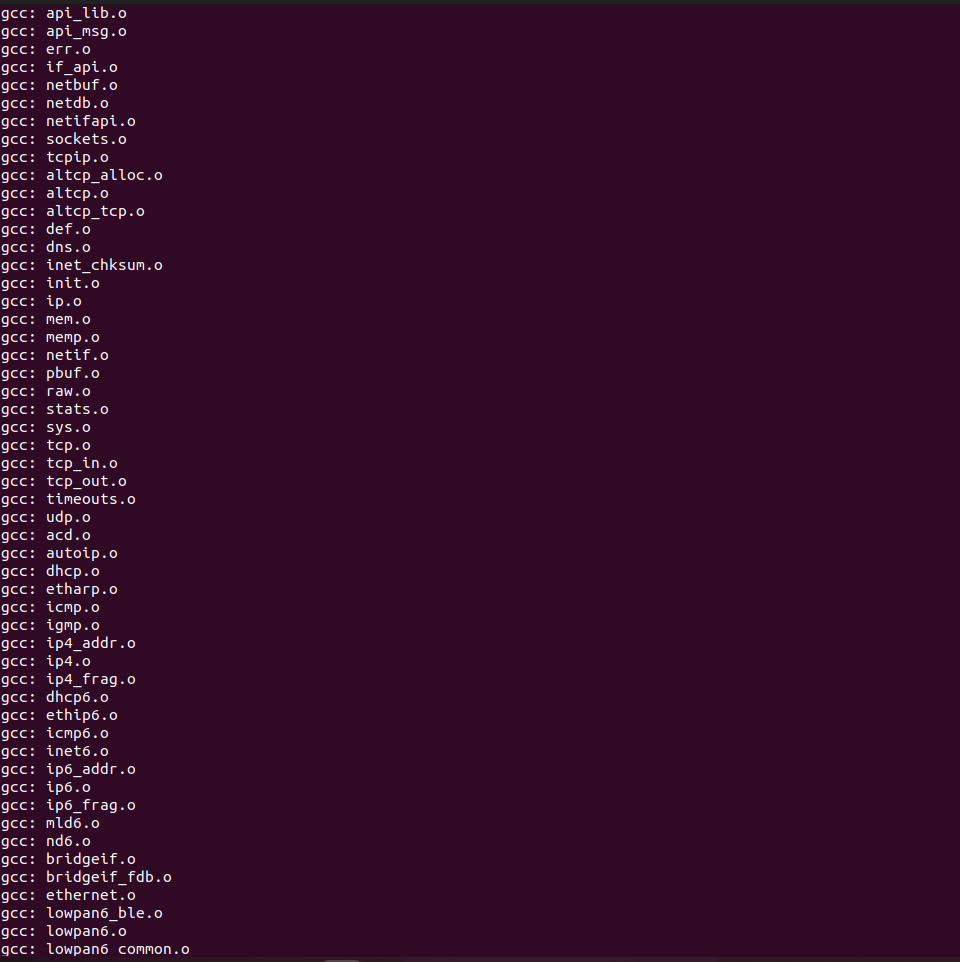
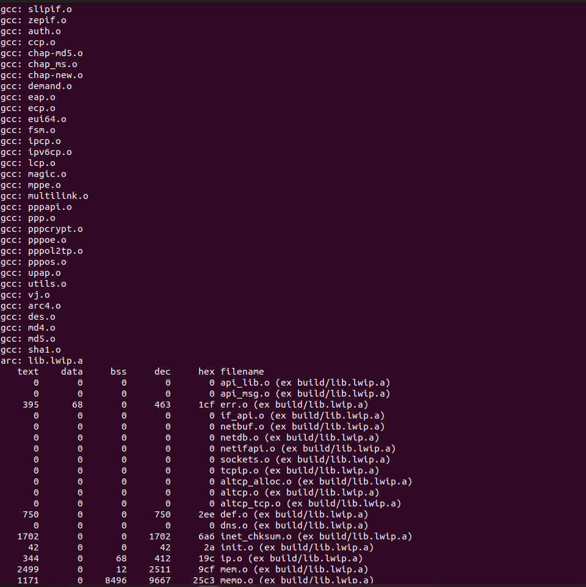
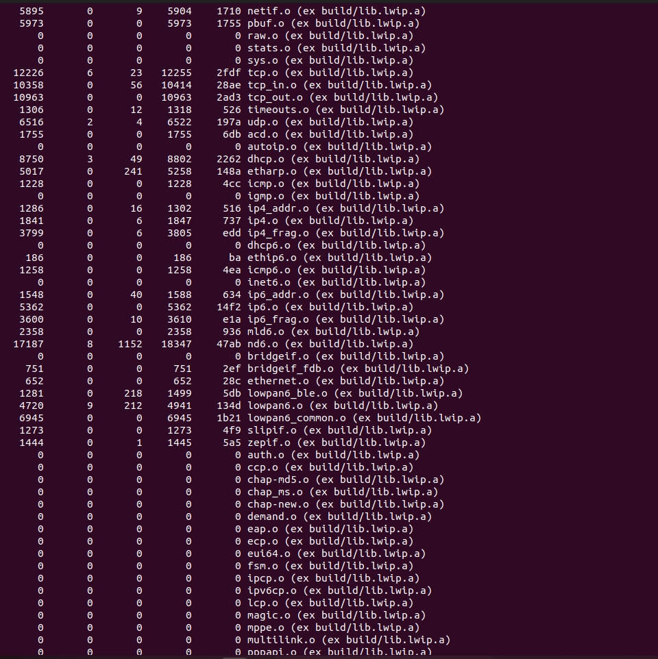

# Makefile template for creating libraries

```bash
  git clone https://github.com/mcu/mklib.git
  cd mklib
  make
```





## How to use

  * delete 'img' folder and 'README.md' file to cleanup template;
  * rename folder 'mkdir';
  * replace 'lwip' folder with your own source code;
  * set path to C compiler directory (makefile variable CCDIR);
  * specify a processor (makefile variable CORE);
  * change other variables if needed;
  * 'make build' > fix > 'make clean' until your source code compiles successfully into library.
 
